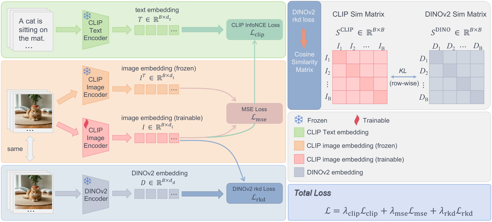
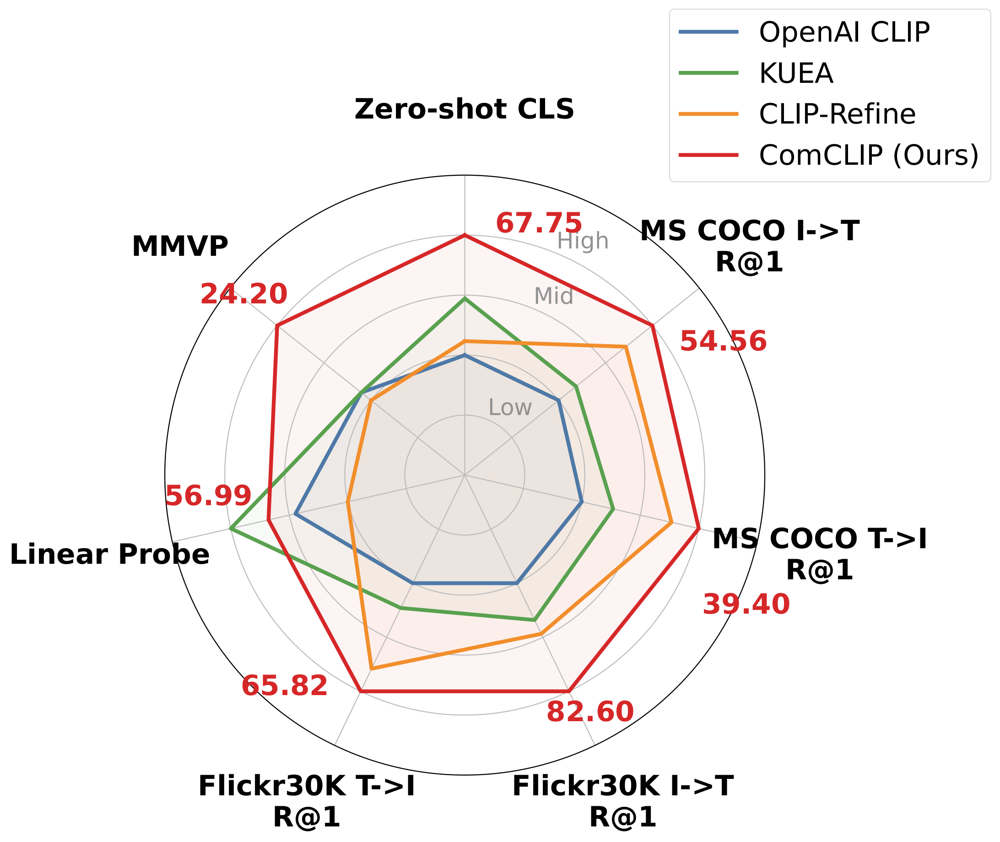

# Rethinking Contrastive Loss in CLIP Post-training: A Complementary Framework with Frozen Text Encoder

Official implementation of the NeurIPS 2026 paper
**Rethinking Contrastive Loss in CLIP Post-training: A Complementary Framework with Frozen Text Encoder**
by Zidan Wang, Yaqian Li, Xiaokai Zhang, Kaiwen Long, Kun He, and Hanpeng Liu.

<p align="center">
  
</p>

## Overview

Recent CLIP post-training methods avoid the standard contrastive loss. They argue that small batches
give too few negatives and cause catastrophic forgetting. We revisit this premise and find that, for
InfoNCE, the forgetting comes mainly from **the magnitude of the contrastive temperature $\tau$**, not
from batch size.

- **Finding 1: Temperature matters more than batch size.** Inheriting the pretraining initialization
  $\tau \approx 0.07$ drops 12-dataset zero-shot accuracy of ViT-B/16 from 61.82 to 57.90. With
  $\tau = 0.01$, the same objective improves it to 62.90. A small $\tau$ makes the gradient on pairs
  that pretrained CLIP already separates vanish, so updates concentrate on the few hard negatives.
- **Finding 2: The losses act on separable groups of metrics.** The contrastive loss drives zero-shot
  classification and retrieval, MSE anchoring to the original encoder preserves transferable features,
  and relational distillation from DINOv2 further improves linear probing.

Building on these findings, **ComCLIP** is a lightweight single-epoch post-training recipe. It freezes
the CLIP text encoder and trains only the vision encoder with three losses on the post-projection
embedding:

$$
\mathcal{L}_{\text{ComCLIP}} = \lambda_{\text{clip}}\mathcal{L}_{\text{clip}} + \lambda_{\text{mse}}\mathcal{L}_{\text{mse}} + \lambda_{\text{rkd}}\mathcal{L}_{\text{rkd}}
$$

| Loss | Role | Code |
|---|---|---|
| $\mathcal{L}_{\text{clip}}$ | Symmetric InfoNCE against the frozen text encoder, with $\tau$ fixed at 0.01 | `--clip_weight`, `--scale`, `--scale_learn False` |
| $\mathcal{L}_{\text{mse}}$ | MSE anchoring to a frozen copy of the original CLIP vision encoder | `--fdimg_weight` |
| $\mathcal{L}_{\text{rkd}}$ | Row-wise KL between batch similarity distributions of CLIP and DINOv2 ($T = 0.1$) | `--dinorkd_weight` |

The refined vision encoder has the same architecture and inference cost as the original. It is a
drop-in replacement for CLIP, including inside LLaVA-1.5.

## Main Results

<p align="center">
  
</p>

ViT-B/16 rows marked with ± are means over 3 seeds. CLIP-Refine and KUEA are each reported in their
strongest setting; see the paper for dataset-matched comparisons.

| Backbone | Method | Zero-shot (12 avg) | COCO I→T | COCO T→I | Flickr I→T | Flickr T→I | Linear Probe (5 avg) | MMVP |
|---|---|---|---|---|---|---|---|---|
| ViT-B/16 | OpenAI CLIP | 61.82 | 48.16 | 31.47 | 74.70 | 57.10 | 44.70 | 12.59 |
| | + KUEA (ImageNet-1K) | 62.07 | 48.48 | 31.99 | 75.00 | 57.62 | 44.65 | 11.85 |
| | + CLIP-Refine (COCO) | 62.87±0.11 | **54.17**±0.28 | **37.72**±0.07 | **81.30**±0.40 | **64.45**±0.21 | 42.28±0.62 | 16.05±1.14 |
| | **+ ComCLIP (CC3M)** | **63.00**±0.13 | 52.49±0.28 | 36.17±0.02 | 77.80±0.00 | 63.11±0.09 | **48.99**±0.35 | 14.81±2.97 |
| ViT-L/14 | OpenAI CLIP | 66.12 | 50.04 | 34.29 | 77.90 | 59.80 | 54.90 | 17.78 |
| | + KUEA (ImageNet-1K) | 66.89 | 50.88 | 35.66 | 79.50 | 61.18 | **59.92** | 17.78 |
| | + CLIP-Refine (COCO) | 66.31 | 53.28 | 38.21 | 80.10 | 64.56 | 50.83 | 17.04 |
| | **+ ComCLIP (CC3M)** | **67.75** | **54.56** | **39.40** | **82.60** | **65.82** | 56.99 | **24.20**±0.86 |

When used as a drop-in vision encoder for LLaVA-1.5-7B, with the projector and LLM kept frozen,
ComCLIP produces no net change across 8 VLM benchmarks (mean relative change +0.02%). The refinement
does not break downstream compatibility.

## Setup

```bash
git clone https://github.com/showstarpro/ComCLIP.git
cd ComCLIP
conda create -n comclip python=3.10
conda activate comclip

# PyTorch 2.0.1 + torchvision 0.15.2 (CUDA 11.8)
pip install torch==2.0.1 torchvision==0.15.2 --index-url https://download.pytorch.org/whl/cu118
pip install -r requirements.txt
```

The main dependencies are `torch==2.0.1`, `torchvision==0.15.2`, `open-clip-torch==2.19.0`, and
`webdataset==0.2.48`. If you cannot reach the PyTorch index, download the wheel for your platform
from <https://download.pytorch.org/whl/cu118/torchvision/> and install it with
`pip install torchvision-0.15.2+cu118-cp310-cp310-linux_x86_64.whl`.

### Pretrained weights

No weights are bundled with the repository. All of them are downloaded automatically on first use.
For offline machines, download them in advance as described below.

**OpenAI CLIP (student).** OpenCLIP downloads the weights automatically when you pass
`--pretrained openai`. To pre-download them, run:

```bash
python -c "import open_clip; open_clip.create_model_and_transforms('ViT-B-16', pretrained='openai'); open_clip.create_model_and_transforms('ViT-L-14', pretrained='openai')"
```

**DINOv2 (teacher).** The teacher is loaded with
`torch.hub.load('facebookresearch/dinov2', '<model_name>')`, where `--model_name` defaults to
`dinov2_vitl14_reg`. This needs two items in the `torch.hub` cache (`~/.cache/torch/hub` by default,
or `$TORCH_HOME/hub`):

1. **The DINOv2 code.** We used commit
   [`7b187bd`](https://github.com/facebookresearch/dinov2/tree/7b187bd4df8efce2cbcbbb67bd01532c19bf4c9c).
   Without internet access, `torch.hub` (torch 2.0.1) looks for it under the folder name
   `facebookresearch_dinov2_main`:

   ```bash
   mkdir -p ~/.cache/torch/hub && cd ~/.cache/torch/hub
   wget https://github.com/facebookresearch/dinov2/archive/7b187bd4df8efce2cbcbbb67bd01532c19bf4c9c.zip -O dinov2.zip
   unzip dinov2.zip && mv dinov2-7b187bd4df8efce2cbcbbb67bd01532c19bf4c9c facebookresearch_dinov2_main && rm dinov2.zip
   ```

2. **The DINOv2 weights**, from the official DINOv2 release:

   ```bash
   mkdir -p ~/.cache/torch/hub/checkpoints && cd ~/.cache/torch/hub/checkpoints
   # ViT-L/14 with registers (default teacher, used in the paper)
   wget https://dl.fbaipublicfiles.com/dinov2/dinov2_vitl14/dinov2_vitl14_reg4_pretrain.pth
   # ViT-B/14 with registers (optional, for --model_name dinov2_vitb14_reg)
   wget https://dl.fbaipublicfiles.com/dinov2/dinov2_vitb14/dinov2_vitb14_reg4_pretrain.pth
   ```

## Data Preparation

| Dataset | Format | Arguments |
|---|---|---|
| CC3M | WebDataset shards | `--dataset cc3m --wds_path ".../cc3m-train-{0000..0575}.tar" --wds_train_length 3000000` |
| CC12M | WebDataset shards | `--dataset cc12m --wds_path ...` |
| COCO Caption | `train2017` images + `captions_train2017.json` | `--dataset coco --coco_img_dir ... --coco_annotation_file ...` |

`--imagenet_root` points to ImageNet-1K. It is only used for zero-shot monitoring during training.

## Training

The default ComCLIP recipe is 1 epoch on 8 GPUs with a global batch size of 1,024 (128 × 8). It uses
AdamW (lr 1e-6, weight decay 0.1, 410 warm-up steps), a fixed $\tau = 0.01$, and all loss weights set
to 1.0.

All experiments in the paper are wrapped in [train.sh](train.sh). Set the dataset and output paths
at the top of the script, then run an experiment by name:

```bash
bash train.sh comclip_vitb16_cc3m              # ComCLIP, ViT-B/16, CC3M
bash train.sh comclip_vitl14_coco              # ComCLIP, ViT-L/14, COCO Caption
SEED=42 bash train.sh comclip_vitb16_cc3m      # another seed
bash train.sh                                  # list all experiments
```

| Experiment | Paper |
|---|---|
| `comclip_{vitb16,vitl14}_{cc3m,coco,cc12m}` | Main results (Table 1) |
| `comclip_siglip_cc3m` | SigLIP backbone (Appendix) |
| `clip_only_tau` / `clip_only_batch_size` / `clip_only_learnable_tau` | Finding 1: temperature vs. batch size vs. learnability |
| `ablation_loss` / `ablation_loss_weights` | Loss decoupling and loss weights |
| `ablation_teacher` / `ablation_before_proj` / `ablation_2ep` | Teacher choice, $\mathcal{L}_{\text{rkd}}$ position, 2 epochs |

`NUM_GPUS` and `BATCH_SIZE` (per GPU) can be overridden from the environment. Keep their product at
1,024 to match the paper. For example, ComCLIP on ViT-B/16 and CC3M expands to:

```bash
torchrun --nproc_per_node=8 -m train.align_training_clip \
    --clip_model_name ViT-B-16 --pretrained openai \
    --dataset cc3m --wds_path "/path/to/data/cc3m/cc3m-train-{0000..0575}.tar" --wds_train_length 3000000 \
    --imagenet_root /path/to/data/imagenet-1k --template std --output_normalize False \
    --total_epochs 1 --warmup 410 --batch_size 128 --opt adamw --lr 1e-6 --wd 0.1 \
    --scale 0.01 --scale_learn False --seed 0 --wandb False \
    --output_dir /path/to/output --experiment_name comclip_vitb16_cc3m_seed0 \
    --log_freq 1 --eval_freq 10 \
    --clip_weight 1.0 --fdimg_weight 1.0 --dinorkd_weight 1.0
```

Key arguments:

- `--scale`: the contrastive temperature $\tau$; the logit scale is $1/\tau$. Values with
  $50 \le 1/\tau \le 200$ all improve zero-shot accuracy over the base model.
- `--scale_learn False`: keeps $\tau$ fixed during post-training.
- `--clip_weight`, `--fdimg_weight`, `--dinorkd_weight`: $\lambda_{\text{clip}}$,
  $\lambda_{\text{mse}}$, and $\lambda_{\text{rkd}}$. Setting a weight to 0 gives the loss-decoupling
  ablations from the paper.
- `--oriclip`: trains with $\mathcal{L}_{\text{clip}}$ only. Combine it with `--scale` for the
  temperature study (Finding 1).
- `--model_name`: the DINOv2 teacher. The default is `dinov2_vitl14_reg`. Use
  `--vision_model mae` for the MAE-Large teacher.
- `--before_proj True`: computes $\mathcal{L}_{\text{rkd}}$ on the pre-projection embedding (an
  appendix ablation).

The final checkpoint is saved to
`<output_dir>/<model>_openai_<dataset>_..._<experiment_name>_<id>/checkpoints/final.pt`.

The KUEA and CLIP-Refine baselines were reproduced with their official codebases and are not
included in this repository.

## Evaluation

We evaluate with a modified version of [CLIP_benchmark](https://github.com/LAION-AI/CLIP_benchmark).

```bash
cd CLIP_benchmark
```

1. Prepare the benchmark datasets in WebDataset format under `CLIP_benchmark/datasets/`. If they
   already exist elsewhere, [setup_dataset_symlinks.sh](CLIP_benchmark/setup_dataset_symlinks.sh) can
   create the expected symlinks.
2. List the models to evaluate in `benchmark/models.txt`, one `architecture,checkpoint` pair per
   line. Use `openai` for the original CLIP:

   ```
   ViT-B-16,openai
   ViT-B-16,/path/to/output/<run_name>/checkpoints/final.pt
   ```

3. Run the evaluation. Results are saved as JSON files under `SAVE_DIR`, which defaults to
   `results/`:

   ```bash
   SAVE_DIR=results/comclip ./bash/run_benchmark_clean.sh   # zero-shot classification (12 datasets, benchmark/datasets.txt)
   SAVE_DIR=results/comclip ./bash/run_benchmark_rt.sh      # image-text retrieval on MS COCO and Flickr30K
   SAVE_DIR=results/comclip ./bash/run_benchmark_lp.sh      # linear probing (5 datasets, benchmark/datasets_lp.txt)
   ```

   To summarize the results into Markdown, CSV, and JSON tables, run:

   ```bash
   python collect_results.py --result_dir results/comclip --model_file benchmark/models.txt \
       --output_dir output --add_openai_baseline
   ```

4. **MMVP** ([MMVP-VLM](https://huggingface.co/datasets/MMVP/MMVP_VLM)):

   ```bash
   python -m clip_benchmark.metrics.evaluate_mmvp \
       --model_name ViT-L-14 \
       --pretrained /path/to/output/<run_name>/checkpoints/final.pt \
       --benchmark_dir /path/to/MMVP_VLM
   ```

   MMVP has only 135 image pairs, so one pair is 0.74 points. Report means over multiple seeds.

The evaluation datasets are:

- Zero-shot classification: ImageNet-1K, CIFAR-10/100, Caltech101, FER2013, OxfordPets, DTD,
  RESISC45, EuroSAT, PCAM, ImageNet-Sketch, and ImageNet-O.
- Linear probing: ImageNet-1K, SVHN, GTSRB, CLEVR Distance, and CLEVR Counts.

## Downstream VLM (LLaVA-1.5)

To test drop-in compatibility, replace the vision tower of LLaVA-1.5-7B with a post-trained ViT-L/14
checkpoint, keeping the projector and LLM frozen, and evaluate on AI2D, POPE, RefCOCOg, V\*, MME,
ScienceQA-IMG, OCRBench, and TextVQA. The [LLaVA](LLaVA) folder is adapted from the
[official LLaVA repository](https://github.com/haotian-liu/LLaVA). Set the `--vision_tower` field to
your checkpoint, and see `LLaVA/scripts/v1_5/eval/` for the evaluation scripts.

## Checkpoints

Post-trained ComCLIP checkpoints (ViT-B/16 and ViT-L/14) will be released soon.

## Acknowledgements

This codebase builds on [KUEA](https://github.com/peterant330/KUEA),
[CLIP_benchmark](https://github.com/LAION-AI/CLIP_benchmark),
[OpenCLIP](https://github.com/mlfoundations/open_clip), [DINOv2](https://github.com/facebookresearch/dinov2),
[LLaVA](https://github.com/haotian-liu/LLaVA), and [OpenFlamingo](https://github.com/mlfoundations/open_flamingo).
We thank the authors for releasing their code.

## Citation

If you find this work useful, please cite:

```bibtex
@inproceedings{wang2026rethinking,
  title     = {Rethinking Contrastive Loss in CLIP Post-training: A Complementary Framework with Frozen Text Encoder},
  author    = {Wang, Zidan and Li, Yaqian and Zhang, Xiaokai and Long, Kaiwen and He, Kun and Liu, Hanpeng},
  booktitle = {Advances in Neural Information Processing Systems (NeurIPS)},
  year      = {2026}
}
```
